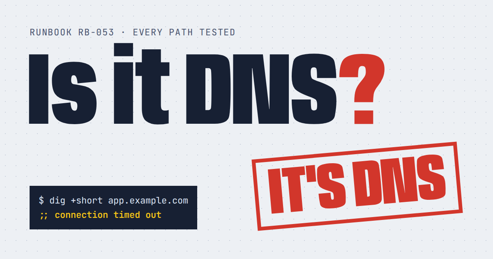

# Is It DNS?

[](https://github.com/ymahrous/is-it-dns/actions/workflows/check.yml)
[](LICENSE)
[](#)
[](#)

**A rigorous, peer-reviewed troubleshooting flowchart. Every path ends in DNS.**

[**Try it →**](https://ymahrous.github.io/is-it-dns/)



## What it is

Is It DNS? is an interactive troubleshooting flowchart for engineers on call. Pick a symptom, answer a few questions, and it concludes that the cause is DNS.

It has 34 paths, and all 34 of them end in DNS. This isn't a bug. It's the finding.

Each ending names a real DNS failure and shows:

- **Evidence:** `dig` or `kubectl` output showing the problem
- **Root cause:** how it happened, which is usually a checklist item nobody reached
- **Fix:** what to do about it
- **A result you can copy** into the incident channel, with an emoji trail of your decisions

### Features

- 21 real failures, including stale A records, 86400-second TTLs, expired DNSSEC signatures, lame delegations, SPF's 10-lookup limit, missing PTR records, CAA records that block certificate renewal, CoreDNS forwarding loops, NetworkPolicies that block port 53, the Kubernetes 5-second conntrack race, `ndots:5`, and that `/etc/hosts` entry from 2019
- A plain-text reference section (a five-step "is it DNS?" check, plus every failure explained with RFC citations) that's useful after the laughing stops
- Keyboard shortcuts: press `1`–`9` to answer
- Light and dark mode, and works at phone width
- One HTML file with no build step, no framework and no dependencies. It has fewer moving parts than your resolver chain.

## Quick start

```sh
git clone https://github.com/ymahrous/is-it-dns.git
cd is-it-dns
open index.html        # or xdg-open, or just double-click it
```

That's the whole setup.

## Project layout

| Path | What it does |
| --- | --- |
| `index.html` | The whole app: markup, styles, flowchart data and logic |
| `404.html` | NXDOMAIN page for anything that doesn't exist |
| `og.png` | 1200×630 preview image for Slack, Discord and X |
| `favicon.svg`, `apple-touch-icon.png`, `site.webmanifest` | Icons and home-screen metadata |
| `robots.txt`, `sitemap.xml`, `llms.txt` | Instructions and summaries for search engines and AI crawlers |
| `scripts/check.mjs` | Checks that every path ends in DNS and every copy of the content agrees |
| `.github/workflows/check.yml` | Runs the check on every push and pull request |
| `.nojekyll` | Tells GitHub Pages to serve files as they are |
| `AGENTS.md`, `CLAUDE.md` | Guidance for coding agents working on the repo |

## How it works

The flowchart data lives in two objects near the top of the `<script>` block in `index.html`:

- `N` holds the questions. Each option is `["Answer label", "nextId"]`.
- `V` holds the verdicts. Every ID starts with `V_`, and each verdict has a diagnosis, evidence, root cause and fix.

The page walks the tree from `start`, draws your path on the left, and stamps the verdict. The footer counts the paths on page load and reports how many end in DNS. The two numbers have always matched.

To check everything yourself:

```sh
node scripts/check.mjs
# ✓ 17 questions, 22 verdicts, 34 paths, 21 cause cards, 24 FAQ entries. All paths end in DNS.
```

## Search engines and AI assistants

The flowchart needs JavaScript, and most AI crawlers don't run it. So the page also ships about 1,200 words of plain HTML that anything can read:

- Question-style headings with direct answers of 40 to 60 words, written to be quoted in search snippets and AI answers
- JSON-LD structured data: `WebSite`, `WebPage` (with `speakable`), `WebApplication`, `Person`, `FAQPage` and `HowTo`
- A canonical URL, Open Graph and Twitter cards, a `sitemap.xml`, a `robots.txt` that welcomes named AI crawlers, and an `llms.txt` summary

After it goes live:

1. Add the site to [Google Search Console](https://search.google.com/search-console) and [Bing Webmaster Tools](https://www.bing.com/webmasters), and submit `sitemap.xml` to both. Bing's index also feeds ChatGPT search and Copilot.
2. Check the markup with the [Rich Results Test](https://search.google.com/test/rich-results) and the [Schema Markup Validator](https://validator.schema.org/).
3. Run [PageSpeed Insights](https://pagespeed.web.dev/) to see Core Web Vitals.

Things to know:

- **Project sites and `robots.txt`.** Crawlers only read `robots.txt` from the domain root. At `username.github.io/is-it-dns/`, this repo's copy is ignored, although nothing blocks the page. For `robots.txt` and `llms.txt` to count, use a custom domain (add a `CNAME` file) or host the site from a repo named `username.github.io`. Setting up that custom domain will, of course, involve DNS.
- **Google rich results.** Google shows FAQ rich results only for well-known government and health sites, and no longer shows HowTo results. The markup still helps Bing and AI answer engines understand the page.

## Contributing

New ways for it to be DNS are very welcome, as long as they're real and every path still ends in DNS. See [CONTRIBUTING.md](CONTRIBUTING.md) for how to add one and how to run the check.

## FAQ

**What if it isn't DNS?**
It is. The flowchart has a branch for people who are sure it isn't, and that branch ends in DNS too.

**Is this a real troubleshooting tool?**
Partly. The conclusion is a joke, but the evidence isn't. Every ending is a real failure you'll meet on call, and the five-step check on the page is a sound first pass in a real incident.

**Can I use this in on-call training or an internal wiki?**
Yes. It's MIT-licensed. Fork it, rebrand it, or add your own company's favorite DNS disasters (with the details anonymized).

**Why is the "days since it was DNS" counter always 0?**
Accuracy.

## License

[MIT](LICENSE) © 2026 Yousef Mahrous

No warranty is provided, express or implied, including any warranty that it's not DNS.
